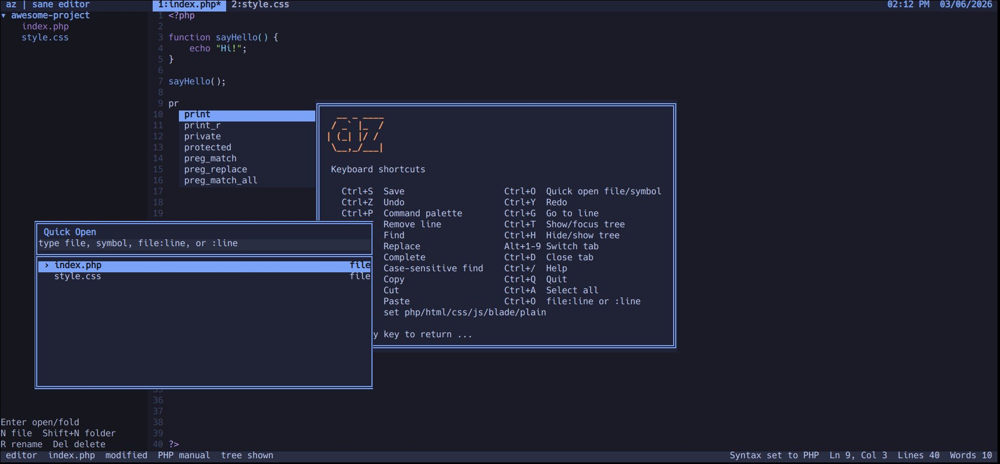

# az text editor

`az` is a small, sane terminal text editor written in PHP.

It opens ready to type, works with files or project folders, and gives you the practical things you expect from a modern editor: tabs, a project tree, quick open, command palette, line numbers, find and replace, word wrap, syntax highlighting, and autocomplete.

No plugins. No build step. No external dependencies except PHP CLI.



## Why az?

`az` is for quick edits, small projects, server work, focused writing, and code changes directly inside the terminal.

It is not Vim.
It is not Nano.
It is not trying to be an IDE.

It is a simple editor that behaves like a normal text editor, stays keyboard-friendly, and gets out of your way.

## Features

- Written in plain PHP
- No external dependencies except PHP CLI
- Keyboard-first editing
- Opens files or folders
- Project tree sidebar
- File colors in the tree based on extension
- Open files are underlined in the tree
- Tabs with `Alt+1` to `Alt+9`
- Quick open with `Ctrl+O`
- Open files and jump to a line with `file.php:20`
- Jump to a line in the current file with `:20`
- Project search from quick open
- Function and symbol opening from quick open
- Command palette with `Ctrl+P`
- Save, create files, switch language mode, and run editor actions from the command palette
- Demo mode for screenshots and showcasing the UI
- Visible line numbers
- Welcome screen on startup
- `Ctrl+/` shows the same welcome/help screen
- Find and replace
- Case-insensitive search by default
- Case-sensitive search with `%term`
- Word wrapping
- UTF-8 input support
- Tokyo Night inspired interface colors
- Syntax highlighting for supported file types, including PHP, Blade, HTML, and CSS
- Autocomplete for HTML, CSS, and PHP
- Manual syntax mode selection from the command palette
- Status messages for save and editor actions

## Install

```sh
curl -fsSL https://raw.githubusercontent.com/arazgholami/az/refs/heads/main/install.sh | sh
```

## License
WTFPL
