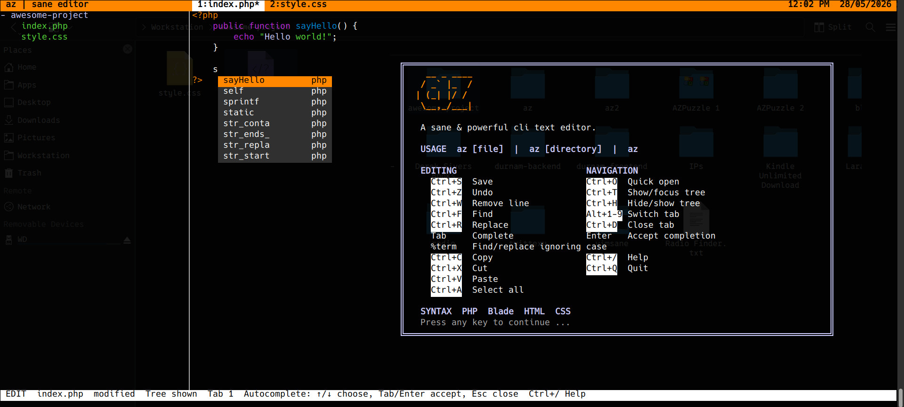

# az

`az` is a small, sane terminal text editor written in PHP.
It opens ready to type, supports project folders, tabs, quick file opening, simple keyboard shortcuts and syntax highlighting with Autocompletion.



## Features

- Keyboard-only editing
- Opens files or folders
- Project tree sidebar
- Tabs with Alt+1 to Alt+9
- Quick open with Ctrl+O
- Find and replace
- Case-insensitive find/replace with `%term`
- Word wrapping
- UTF-8 input support
- Syntax highlighting for PHP, Blade, HTML, and CSS
- Autocomplete for HTML, CSS, and PHP
- No external dependencies except PHP CLI

## Install

```sh
curl -fsSL https://raw.githubusercontent.com/arazgholami/az/refs/heads/main/install.sh | sh
```

Then run:

```sh
az
```

Or open a file or folder:

```sh
az file.php
az ~/my-project
```

## Manual install

```sh
mkdir -p ~/.local/bin
curl -fsSL https://raw.githubusercontent.com/arazgholami/az/refs/heads/main/az -o ~/.local/bin/az
chmod +x ~/.local/bin/az
```

Make sure `~/.local/bin` is in your `PATH`:

```sh
export PATH="$HOME/.local/bin:$PATH"
```

## Requirements

- Linux, macOS, or another Unix-like terminal
- PHP CLI

On Debian or Ubuntu:

```sh
sudo apt install php-cli
```

## Shortcuts

| Shortcut | Action |
| --- | --- |
| Ctrl+S | Save |
| Ctrl+O | Quick open |
| Ctrl+T | Switch between tree and editor |
| Ctrl+H | Hide or show tree |
| Ctrl+F | Find |
| Ctrl+R | Replace |
| Ctrl+W | Remove current line |
| Ctrl+Z | Undo |
| Ctrl+D | Close tab |
| Ctrl+/ | Help |
| Ctrl+Q | Quit |
| Tab | Complete suggestion |
| Enter | Accept selected completion |
| Alt+1..9 | Switch tab |

## Notes

az is intentionally simple. It is not trying to replace a full IDE. It is a fast terminal editor for small projects, quick fixes, and focused editing.
